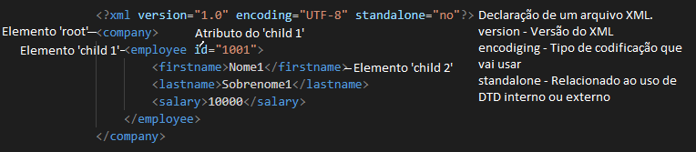

# Compilado de exemplos de leitura e escrita de arquivos XML e Json em um projeto Maven


## XML - eXtensible Markup Language

É uma linguagem de marcação composta por diversos elementos para facilitar o compartilhamento de informações por intermédio da internet.

Um elemento pode conter:
* Texto
* Atributos
* Outros elementos


Elementos XML devem seguir estas regras de nomenclatura:
* Os nomes dos elementos são case-sensitive
* Os nomes dos elementos deve começar com uma letra ou  sublinhado
* Os nomes dos elementos não pode começar com o xml letras (or XML, or Xml, etc)
* Os nomes dos elementos podem conter letras, números, hífens, sublinhados e períodos
* Os nomes dos elementos não podem conter espaços
  
Estrutura básica de um XML



## Dependências 

Dependências necessárias para executar os exemplos que usam XML.

```xml
    <dependencies>
        <dependency>
            <groupId>javax.xml.bind</groupId>
            <artifactId>jaxb-api</artifactId>
            <version>2.3.1</version>
        </dependency>
        <dependency>
            <groupId>com.sun.xml.bind</groupId>
            <artifactId>jaxb-impl</artifactId>
            <version>3.0.0</version>
        </dependency>
	  <dependency>
	      <groupId>org.eclipse.persistence</groupId>
	      <artifactId>org.eclipse.persistence.moxy</artifactId>
	      <version>3.0.0</version>
	  </dependency> 
```

Dependências necessárias para executar os exemplos usando Json.

```xml
	<dependency>
	    <groupId>javax.json</groupId>
	    <artifactId>javax.json-api</artifactId>
	    <version>1.1.4</version>
	</dependency>	    
	<dependency>
	    <groupId>org.glassfish</groupId>
	    <artifactId>javax.json</artifactId>
	    <version>1.0.4</version>
	</dependency>	  
	<dependency>
	    <groupId>com.google.code.gson</groupId>
	    <artifactId>gson</artifactId>
	    <version>2.8.9</version>
	</dependency>	
```  

Outras dependências e informações podem ser inseridas no arquivo [POM](src/../pom.xml).


## XSD

Arquivo utilizado para validar as informações de um arquivo XML, pode ser usado para verificar os campos, se está na ordem correta, tipo correto por exemplo. Abaixo segue alguns exemplos de declarçaão de elementos e atributos.

Declaração de elementos:
* name: especifica o nome do elemento
* type: especifica o tipo de dados do elemento
* minOccurs: especifica o mínimo de vezes que o elemento pode aparecer
* maxOccurs: especifica o máximo de vezes que o elemento pode aparecer

Declaração de atributos:
* name: especifica o nome do atributo
* type: especifica o tipo de dados do atributo
* use: especifica a utilização do atributo (requerido, opcional ou proibido).


Os tipos mais comuns de dados utilizados em um XML Schema são:

* xsd:string – string de caracteres de comprimento ilimitado
* xsd:boolean – valor booleano (true (1) ou false (0))
* xsd:decimal – número decimal
* xsd:float – ponto flutuante
* xsd:date – Uma data no calendário gregoriano
* xsd:dateTime – Um instante específico no calendário gregoriano
* xsd:integer – Um número inteiro

É possível verificar se a ordem dos elementos estão corretas através de conectores, sendo eles:

* sequence - O arquivo XML deve obedecer essa sequência de elementos.
* all - Precisa ter todos os elementos, mas não em ordem.
* choice - Somente um dos elementos deve estar presente.

Ao usar esses conectores, é necessário usar a tag <xsd:complexType> ao montar o arquivo XSD conforme exemplo abaixo.

```xml
<xsd:element name="pessoa">
 <xsd:complexType>
  <xsd:sequence>
   <xsd:element name="nome" type="xsd:string" minOccurs="0" maxOccurs="1"/>
   <xsd:element name="endereco" type="xsd:string"/>
   <xsd:element name="cep" type="xsd:integer"/>
  </xsd:sequence>
 </xsd:complexType>
</xsd:element>
```

### XML DOM(Document Object Model)

É uma forma de acessar e manipular arquivos XML.

Um exemplo de utilização pode ser visto no [arquivo](src/main/java/DOMParser/XmlPOJODOM.java). Método main le o [file_amostra.xml](src/main/resources/file_amostra.xml) e percore todos os elementos filhos e adiciona em uma lista de [Employee](src/main/java/DOMParser/Employee.java). As classes usadas são:

Definições de acordo com Oracle
* DocumentBuilderFactory - Defines a factory API that enables applications to obtain a parser that produces DOM object trees from XML documents.
* DocumentBuilder -  Defines the API to obtain DOM Document instances from an XML document. Using this class, an application programmer can obtain a Document from XML.
* Document - The Document interface represents the entire HTML or XML document. Conceptually, it is the root of the document tree, and provides the primary access to the document's data.
* NodeList - The NodeList interface provides the abstraction of an ordered collection of nodes, without defining or constraining how this collection is implemented. NodeList objects in the DOM are live.
* Node - The Node interface is the primary datatype for the entire Document Object Model. It represents a single node in the document tree.
* Element - The Element interface represents an element in an HTML or XML document. Elements may have attributes associated with them; since the Element interface inherits from Node, the generic Node interface attribute attributes may be used to retrieve the set of all attributes for an element. There are methods on the Element interface to retrieve either an Attr object by name or an attribute value by name. In XML, where an attribute value may contain entity references, an Attr object should be retrieved to examine the possibly fairly complex sub-tree representing the attribute value. 

Para fim de teste, após ler esse arquivo é usado o método insertEmployeeXml("renan", "rodolfo", 32000) para gerar um novo arquivo XML contendo os employees já lidos e inserindo um novo employee. É então criado os elementos e realizado a associação de root-child. Por fim, é escrito em um arquivo chamado file_amostra3.xml com o método writeXml().


### JAXB

  
### Json para objeto Java


### Objeto java para Json


## Referências

https://www.mballem.com/post/xml-trabalhando-com-jaxb/
https://mkyong.com/java/jaxb-hello-world-example/
https://mkyong.com/java/how-to-create-xml-file-in-java-dom/ https://mkyong.com/java/how-to-read-xml-file-in-java-dom-parser/ https://www.tutorialspoint.com/java_xml/java_dom_parse_document.htm https://www.devmedia.com.br/trabalhando-com-a-biblioteca-xstream-em-java/27194 https://www.programcreek.com/java-api-examples/?class=org.w3c.dom.Node&method=ELEMENT_NODE https://www.baeldung.com/java-modify-xml-attribute https://www.w3schools.com/xml/schema_howto.asp https://www.delftstack.com/pt/howto/java/java-read-xml/ https://www.eclipse.org/eclipselink/documentation/2.4/solutions/jpatoxml003.htm
https://javaee.github.io/jaxb-v2/doc/user-guide/ch03.html
https://www.w3schools.com/xml/schema_example.asp
https://www.devmedia.com.br/como-converter-objetos-java-para-ou-de-json-com-a-biblioteca-gson/28091
https://www.macoratti.net/vb_xml2.htm
http://www.w3bai.com/pt/xml/xml_elements.html
